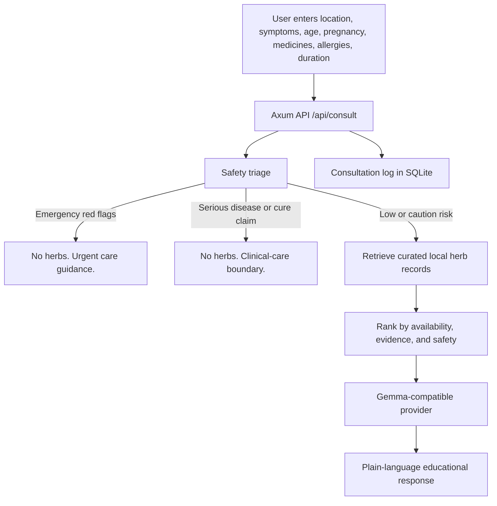

# Gemma HerbalCare

**A safety-first herbal knowledge navigator for low-resource communities. Built for the Gemma 4 Hackathon.**

Gemma HerbalCare helps people explore local herbal knowledge without turning an AI model into an unsafe doctor. It is designed for places where clinics can be far away, internet health information is unreliable, and families may try home remedies before they can reach professional care.

The product idea is simple: when someone asks about herbs, the first answer should not be a confident guess. It should first check for danger.

If symptoms look mild, Gemma HerbalCare retrieves curated local herb records and asks a Gemma-compatible model to explain them in plain, cautious language. If the user mentions chest pain, difficulty breathing, pregnancy bleeding, suspected malaria, cancer cure requests, severe fever, HIV/AIDS without care, or other red flags, the app does not show herbs. It gives urgent care guidance instead.

This is not a replacement for clinicians. It is a safer bridge between "I feel sick" and "I can reach care."

## Why This Matters

In many developing countries, herbal medicine is not an alternative lifestyle choice. It is often what people have nearby.

That reality deserves respect, but it also needs guardrails. A helpful answer can support hydration, comfort, nutrition, and care-seeking. A careless answer can delay treatment for malaria, sepsis, pregnancy complications, heart attack, severe dehydration, cancer, or dangerous medicine interactions.

Generic AI chatbots are risky here because they can invent herbs, dosing, cures, or false reassurance while sounding fluent. Gemma HerbalCare keeps the model on a narrower job:

1. Check safety first.
2. Retrieve only known records.
3. Ask Gemma to explain, not improvise.

With clinician-reviewed datasets and local health partners, this kind of system could prevent real harm by recognizing danger signs earlier, refusing unsafe cure claims, and explaining next steps in language people can actually use.

## What Gemma Does

Gemma is used as a careful community health translator, not as the source of truth.

The backend gives the model:

- the user's location and symptom context
- the triage result
- the retrieved herb records, if the case is safe enough

Gemma is instructed to write from those records only. It must not invent herbs, diagnose disease, prescribe doses, claim cures, or tell users to stop prescribed medicine.

This makes the project more than a chatbot wrapper. The safety-critical decisions happen before generation.

## How It Works



The key rule: **Gemma never decides whether an emergency should receive herbal suggestions.** The app decides that first.

## Core Features

- Red-flag triage before any herb recommendation
- Herb suppression for emergency and urgent cases
- Local SQLite herb library with evidence level, source URL, safety notes, contraindications, interactions, and preparation notes
- Gemma-compatible provider layer with a mock mode for easy judging
- Simple, low-literacy response style
- Rust/Axum backend with clear separation between triage, retrieval, logging, and LLM generation
- SvelteKit frontend with demo cases for mild symptoms, emergencies, malaria, diarrhea/ORS, water safety, and food resilience

## Safety Boundaries

Gemma HerbalCare never claims herbs cure or replace care for serious conditions, including:

- cancer
- HIV/AIDS
- tuberculosis
- malaria
- stroke
- heart attack
- sepsis
- severe infection
- kidney failure
- liver failure
- pregnancy complications
- uncontrolled diabetes

It also refuses to advise stopping or replacing prescribed medicines such as antibiotics, insulin, antiretroviral therapy, chemotherapy, anticoagulants, or emergency care.

## Demo Scenarios

### Mild cough in Bihar, India

The app detects no emergency red flags, retrieves local records such as ginger and Indian borage, and returns cautious education with evidence level, contraindications, interactions, and care-seeking advice.

### Chest pain and difficulty breathing

The app detects emergency red flags and returns urgent-care guidance. No herbs are retrieved or shown.

### Cancer cure request

The app refuses the cure claim, suppresses herbs as cancer treatment, and encourages professional care.

### Suspected malaria

The app treats malaria as urgent. It can explain that quinine historically came from Cinchona bark, but it does not suggest raw bark, self-dosing, or herbal replacement. It pushes testing and appropriate antimalarial medicine from a clinic, pharmacy, or community health worker.

## Tech Stack

- **Backend:** Rust, Axum, Tokio, Serde, SQLx SQLite, reqwest
- **Frontend:** SvelteKit, TypeScript, CSS
- **LLM:** mock Gemma provider by default, HTTP provider through environment variables
- **Database:** local SQLite, auto-migrated and seeded on backend startup

## Repository Structure

```text
backend/
  src/
    safety.rs      # red flags, serious-condition boundaries, triage
    routes.rs      # API handlers
    db.rs          # SQLite schema, seed data, retrieval, logging
    llm.rs         # Gemma provider trait, mock provider, HTTP provider
    models.rs      # request/response/database structs
frontend/
  src/routes/      # SvelteKit UI pages
docs/
  architecture.md
  safety_policy.md
  demo_script.md
```

## Run Locally

Start the backend:

```bash
cd backend
cargo run
```

Start the frontend:

```bash
cd frontend
npm install
npm run dev
```

Open:

```text
http://localhost:5173
```

The frontend expects the API at `http://localhost:8080`.

## Use a Gemma Endpoint

The app runs with a mock provider by default so the full flow can be tested without model setup.

To use an HTTP Gemma-compatible endpoint:

```bash
cd backend
GEMMA_PROVIDER=http GEMMA_MODEL=gemma4 cargo run
```

The default HTTP URL is Ollama's local generate API:

```text
http://localhost:11434/api/generate
```

Override it if your Gemma endpoint runs elsewhere:

```bash
GEMMA_PROVIDER=http GEMMA_API_URL=http://localhost:11434/api/generate GEMMA_MODEL=gemma4 cargo run
```

The provider posts:

```json
{
  "model": "gemma4",
  "prompt": "...",
  "stream": false
}
```

It accepts `text`, `response`, or `choices[0].text` in the JSON response.

## API

- `GET /health`
- `GET /api/herbs?country=&region=&symptom=`
- `POST /api/triage`
- `POST /api/consult`
- `GET /api/consultations/:id`
- `GET /api/demo-cases`

Example consultation:

```json
{
  "country": "India",
  "region": "Bihar",
  "city": "Gaya",
  "symptoms": "mild cough, sore throat, runny nose, temperature 37.8C",
  "age_group": "adult",
  "pregnant": false,
  "known_conditions": [],
  "current_medicines": [],
  "allergies": [],
  "duration_days": 1,
  "care_accessible": false
}
```

## Why This Fits the Hackathon

Gemma HerbalCare has a clear product thesis, a working safety architecture, and a realistic path beyond the demo.

- **Responsible AI:** generation is bounded by triage, retrieval, and refusal rules.
- **Real-world problem:** the app targets health decisions people make before they can reach care.
- **Local-first design:** herb knowledge is regional, sourced, and structured for offline-friendly deployment.
- **Clear model role:** Gemma turns controlled knowledge into understandable guidance.
- **Scalable path:** the same architecture can support multilingual voice flows, clinician-reviewed datasets, and community health worker tools.

## Future Work

- Add clinician-reviewed regional datasets for Vietnam, Southeast Asia, Africa, and Latin America.
- Add multilingual and voice-first flows for low-literacy users.
- Integrate taxonomic validation from sources such as GBIF, POWO, and WFO.
- Add structured medicine interaction checks.
- Add offline deployment bundles for rural clinics and community health workers.
- Add evaluation tests for safety refusal, retrieval grounding, and low-literacy response quality.

## Disclaimer

Gemma HerbalCare is an educational hackathon prototype. It is not medical advice, not a diagnosis, and not a prescription. Real deployment would require clinical review, local regulatory review, language validation, and partnerships with health workers or public health organizations.
