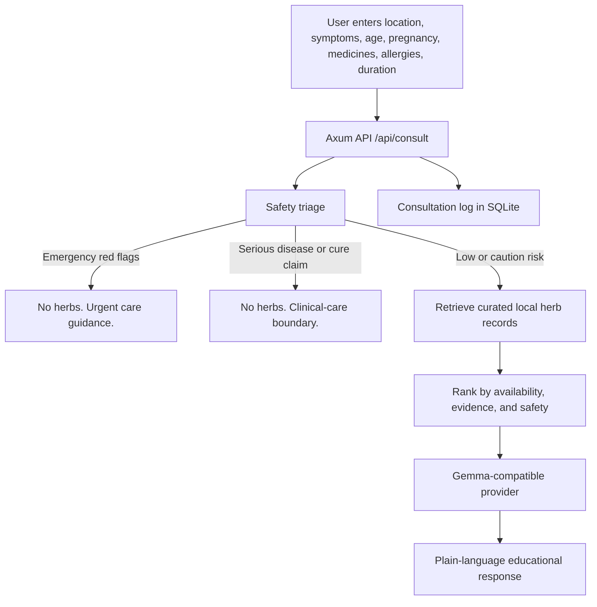
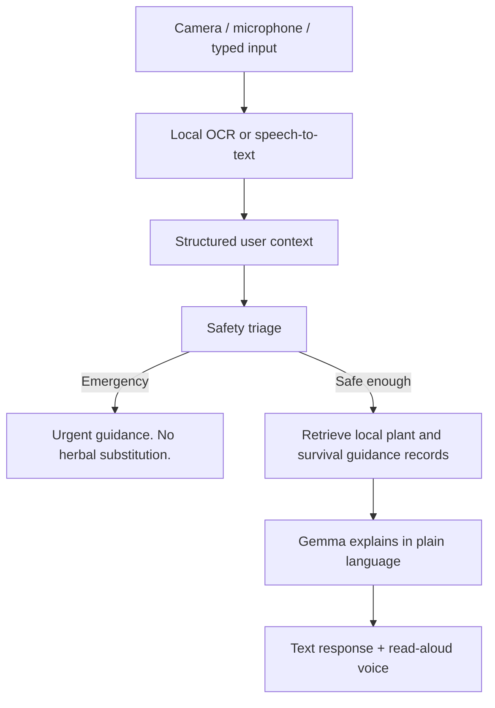

# Gemma HerbalCare

**Gemma HerbalCare is a safety-first, local-first herbal knowledge assistant that helps communities explore traditional remedies without delaying urgent medical care.**

Gemma HerbalCare is built for the Kaggle Gemma 4 Good Hackathon as a practical AI-for-good prototype: not an AI doctor, not a diagnosis system, and not a generic symptom chatbot.

**Live public demo:** https://herbalcare.voidforge.pro/

It is an educational support tool for communities that still depend on local medicinal knowledge, where internet access may be unreliable, clinics may be far away, and traditional plant knowledge is disappearing faster than it is being documented.

The product principle is simple:

**Before suggesting any herb, check whether suggesting herbs would be unsafe.**

If a user describes danger signs such as breathing difficulty, chest pain, pregnancy bleeding, severe fever, suspected malaria, cancer cure requests, or other serious conditions, Gemma HerbalCare suppresses herbal suggestions and gives urgent-care guidance instead. If the situation is lower risk, it retrieves curated local herb records and asks Gemma to explain them in plain, cautious language.

This project treats traditional knowledge with respect while adding the guardrails needed for responsible AI deployment.


## Demo Highlights

- **Public web app:** https://herbalcare.voidforge.pro/
- **Child diarrhea:** prioritizes ORS, hydration, and danger signs before mentioning any herb.
- **Suspected malaria:** recommends urgent testing and appropriate antimalarial care; suppresses herbal substitution.
- **Possible worms in a child:** keeps the response caution-level and points users toward qualified diagnosis and deworming medicine.
- **Cloudy well water:** explains settling, cloth filtering, boiling, and chemical-contamination limits.
- **Long-term food source plan:** suggests realistic local food resilience options such as sweet potato, moringa, and chickens.
- **Poor breathing after indoor smoke:** detects an emergency red flag and returns urgent-care guidance only.

## Visual Guidance for Real Communities

Gemma HerbalCare is designed for people, not papers. The goal is not only to answer questions correctly, but to help communities understand, remember, and act on safe guidance in daily life.

Many users who could benefit from this tool may have limited literacy, limited internet access, limited trust in formal medical language, or little time to read long explanations. For them, a useful AI system must feel closer to a community field guide than an academic report.

That is why the prototype adds a **visual guidance layer** to Gemma responses. When Gemma explains practical steps, the interface can show simple, friendly illustrations for ideas such as:

- preparing ORS and giving small sips
- making cloudy water safer
- starting a small food plot with sweet potato or moringa
- keeping chickens only when water, shade, feed, and protection are realistic
- moving away from indoor smoke and seeking urgent help for breathing trouble
- confirming a plant before preparing it

The philosophy is simple: **solutions for humanity should be understandable at community scale, not only impressive to experts.** A responsible developer should keep asking how to make advice clearer, warmer, safer, and closer to the people who need it.

| Food resilience | ORS and hydration | Safe water | Breathing danger | Plant confirmation |
|---|---|---|---|---|
|  |  |  |  |  |

These illustrations are intentionally simple SVGs. They are lightweight, offline-friendly, culturally adaptable, and safer than asking a generative image model to invent visuals during a consultation.

## Accessibility and Multimodal Direction

The hackathon theme is not just local AI. It is local AI that can help real people. In the communities this app is designed for, some users may not be able to type, read a long answer, see a small phone screen clearly, or describe a plant or medicine label in writing.

The current prototype therefore adds an accessibility layer:

- **Read-aloud response:** the consultation result includes a speaker control that uses browser text-to-speech so a low-literacy user, older adult, or visually impaired user can hear the guidance.
- **Camera intake placeholder:** the consultation form accepts an image upload and preview. In this prototype, the image is not sent to the backend; it documents the intended flow for local OCR and visual triage support.
- **Voice-input placeholder:** the form includes a microphone control explaining the phase-2 plan for local speech-to-text, so users who cannot type can speak symptoms or questions.

The product boundary is important: image input is planned as **visual triage support**, not visual diagnosis. The app should help read labels, inspect water clarity, compare a plant against a curated record, or notice danger signs that need urgent care. It should not claim to diagnose malaria, pneumonia, cancer, skin disease, or any other condition from a photo.

Planned local multimodal stack:

- **Gemma 4 multimodal:** local image/OCR and visual-context understanding where runtime support is available.
- **Local speech-to-text:** offline speech intake for low-literacy users and community health workers.
- **Local text-to-speech:** spoken answers in local languages where suitable voices are available.
- **Safety filter before vision output:** photos can add context, but triage and refusal rules still decide whether herbal advice is safe.

This roadmap fits the core thesis: **AI should still help when the user cannot type, cannot read, has weak connectivity, or cannot reach care immediately.**

## What This Is, and Is Not

Gemma HerbalCare is **not**:

- a doctor replacement
- a medical diagnosis system
- a prescription tool
- a generic symptom checker
- a chatbot that freely invents herbal advice

Gemma HerbalCare **is**:

- a safety-first herbal knowledge assistant
- an educational support tool
- a traditional knowledge preservation platform
- a local-first AI accessibility project
- a retrieval-grounded system for explaining curated regional plant records
- a visual field guide for practical health, hygiene, food resilience, and plant-safety education

## Why This Matters

In many communities, herbal medicine is not an alternative lifestyle choice. It is often the first available response when professional care is delayed by distance, cost, conflict, floods, poor roads, or unreliable connectivity.

At the same time, unguarded AI can be dangerous in exactly this setting. A fluent model can invent herbs, doses, cures, or false reassurance while sounding confident. That can delay treatment for malaria, sepsis, pregnancy complications, severe dehydration, heart attack, cancer, or dangerous medicine interactions.

Gemma HerbalCare exists because two things can be true at once:

1. Local medicinal knowledge is culturally important and practically useful.
2. Serious illness still needs professional care, escalation, and safety boundaries.

The system is designed to preserve and explain local knowledge without turning that knowledge into unsupported medical certainty.

It also recognizes that improving community health is not only about herbs. Safe water, sanitation, hydration, nutrition, smoke exposure, and realistic household resilience matter too. Gemma HerbalCare therefore treats herbal knowledge as one part of a broader education layer for safer daily living.

## Canonical Field User Scenarios

### Rural Health Volunteer With Unreliable Internet

A community health volunteer in northern Vietnam has intermittent connectivity and a basic smartphone. They need to explain common local plants in simple language, but also need help recognizing when the correct response is referral, not home care.

Gemma HerbalCare can run with a local dataset and a small/local Gemma-compatible model so the volunteer can access structured guidance even when the network is weak.

### Flood-Isolated Village Before Outside Support Arrives

A village is temporarily isolated after flooding. People ask about diarrhea, unsafe water, mild cough, and locally available plants. Gemma HerbalCare prioritizes safe water, ORS, danger signs, and escalation while explaining only support-level local knowledge.

The app does not pretend to replace medical response. It helps reduce harm during the gap before care arrives.

### Elderly Villager With Traditional Knowledge

An elder knows local herbs by experience but cannot read medical terminology or internet health pages. Gemma HerbalCare can preserve plant records with local names, safety notes, preparation context, and plain-language explanations that are easier to share across generations.

### Community Worker Explaining Safe Boundaries

A community worker is asked whether herbs can treat suspected malaria or replace prescribed medicine. Gemma HerbalCare refuses unsafe substitution, explains why testing and proven medicine matter, and keeps herbal knowledge in an educational support role.

## Why Gemma Matters

Gemma is used as a careful explainer and contextualizer, **not as the source of medical truth**.

The backend gives Gemma:

- the user's location and symptom context
- the deterministic triage result
- retrieved herb records, if the case is safe enough for herbs

Curated records control the knowledge. Safety rules constrain the workflow. Gemma turns structured information into guidance a low-literacy user can understand.

This is especially important for multilingual and local-first AI. A large model can organize and contextualize knowledge. Smaller local models can make that knowledge accessible offline to communities that need it.

Gemma HerbalCare is therefore designed for:

- multilingual explanation
- low-literacy communication
- visual-first learning support
- accessibility-first interaction with image preview, read-aloud responses, and planned local speech input
- local/offline deployment
- culturally aware plant knowledge
- responsible refusal behavior

## What Makes It Different From a Chatbot

Gemma HerbalCare does not start by generating an answer. It starts by deciding whether generation would be safe.

Workflow:

1. Detect danger first.
2. Refuse unsafe herbal advice.
3. Retrieve curated local herbal records.
4. Ask Gemma to explain, not invent.
5. Log consultation traces for future review and evaluation.

This reduces hallucination risk because the model is not asked to freely produce medicinal claims. It receives bounded records with evidence level, source URL, safety notes, contraindications, interactions, and preparation context.

The goal is educational guidance, not speculative diagnosis.

## Architecture



The key rule: **Gemma never decides whether an emergency should receive herbal suggestions.** The application decides that first.

Planned multimodal extension:



### Technical Stack

- **Backend:** Rust, Axum, Tokio, Serde, SQLx, SQLite, reqwest
- **Frontend:** SvelteKit, TypeScript, CSS
- **Retrieval:** local SQLite herb library with regional availability records
- **LLM integration:** mock provider by default, HTTP Gemma-compatible provider for local or hosted inference
- **Deployment shape:** local-first architecture that can be packaged for clinics, NGOs, community health workers, and offline demos

### Core Modules

```text
backend/
  src/
    safety.rs      # red flags, serious-condition boundaries, triage
    routes.rs      # API handlers
    db.rs          # SQLite schema, seed data, retrieval, logging
    llm.rs         # Gemma provider trait, mock provider, HTTP provider, prompt
    models.rs      # request/response/database structs
frontend/
  src/routes/      # SvelteKit UI pages
docs/
  architecture.md
  safety_policy.md
  demo_script.md
```

### TODO Placeholders

- [ ] Add high-resolution architecture diagram.
- [ ] Add screenshots of consultation, herb library, safety page, and refusal states.
- [ ] Add embedded demo video link.
- [ ] Add offline deployment demo with a local Gemma-compatible endpoint.

## Safety-First Design

Gemma HerbalCare is intentionally conservative. The system never claims herbs cure serious disease and never advises users to stop prescribed medicine.

Safety behaviors include:

- **Emergency suppression:** if red flags are detected, herbs are not retrieved or shown.
- **Refusal behavior:** cure claims and serious disease requests receive clinical-care boundaries.
- **Escalation logic:** the response prioritizes emergency care, clinics, pharmacies, community health workers, or trusted local help.
- **Hallucination minimization:** Gemma receives only retrieved records and explicit safety instructions.
- **Evidence transparency:** each herb record includes evidence level and source context.
- **Medicine caution:** the app warns against replacing antibiotics, insulin, antiretroviral therapy, chemotherapy, anticoagulants, or emergency care.
- **Educational-only framing:** every response is positioned as support information, not diagnosis, prescription, or medical advice.

Gemma HerbalCare suppresses herbal recommendations for emergency or serious conditions, including:

- chest pain
- difficulty breathing
- severe allergic reaction
- pregnancy bleeding or severe pain
- fever above 39.5C
- fever lasting more than 3 days
- suspected malaria
- suspected cancer or cancer cure requests
- HIV/AIDS without clinical care
- tuberculosis
- stroke symptoms
- heart attack symptoms
- sepsis or severe infection
- kidney failure
- liver failure
- uncontrolled diabetes

## Case Studies From the Demo

### Child Diarrhea After Unsafe Water

The app treats diarrhea as a hydration and safety problem first. It emphasizes ORS before herbs, gives the simple fallback recipe for safe water, sugar, and salt when no ORS packet is available, and then explains support-only local plant records with warnings.

### Fever and Suspected Malaria

The app treats suspected malaria as urgent. It can mention that quinine historically came from Cinchona bark, but it does not suggest raw bark, self-dosing, or herbal replacement. It pushes testing and appropriate antimalarial medicine from a clinic, pharmacy, or community health worker.

### Possible Worms in a Child

The app marks the case as caution-level because the user is a child. It keeps the answer focused on professional diagnosis, appropriate deworming medicine from a qualified source, hygiene, and danger signs instead of pretending herbs can confirm or cure parasitic infection.

### Making Cloudy Well Water Safer

The app handles water safety as a practical household question. It explains settling cloudy water, filtering through clean cloth, boiling at a rolling boil for 1 minute, and cooling covered, while warning that boiling and filtering do not remove chemical contamination such as fuel, pesticides, or heavy metals.

### Long-Term Food Source Plan

The app can shift from symptom support to resilience planning. In the demo, it suggests starting small with realistic local food plants such as sweet potato and moringa, and only considering chickens when water, shade, feed, and protection are available.

### Poor Breathing After Indoor Cooking Smoke

The app detects difficulty breathing as an emergency red flag. It suppresses all herb suggestions and returns urgent-care guidance only.

## API

- `GET /health`
- `GET /api/herbs?country=&region=&symptom=`
- `POST /api/triage`
- `POST /api/consult`
- `GET /api/consultations/:id`
- `GET /api/demo-cases`

Example consultation:

```json
{
  "country": "India",
  "region": "Bihar",
  "city": "Gaya",
  "symptoms": "mild cough, sore throat, runny nose, temperature 37.8C",
  "age_group": "adult",
  "pregnant": false,
  "known_conditions": [],
  "current_medicines": [],
  "allergies": [],
  "duration_days": 1,
  "care_accessible": false
}
```

## Run Locally

Start the backend:

```bash
cd backend
cargo run
```

Start the frontend:

```bash
cd frontend
npm install
npm run dev
```

Open:

```text
http://localhost:5173
```

The frontend expects the API at:

```text
http://localhost:8080
```

## Deploy to Google Cloud

The public deployment is live at:

```text
https://herbalcare.voidforge.pro/
```

The project includes a root `Dockerfile` for a single Cloud Run service. The Rust/Axum backend serves both the API and the built SvelteKit frontend, so the whole app can run behind one custom subdomain.

Deployment notes are in [docs/deploy_google_cloud.md](docs/deploy_google_cloud.md).

## Use a Gemma Endpoint

The app runs with a mock provider by default so judges can test the full flow without model setup.

To use an HTTP Gemma-compatible endpoint:

```bash
cd backend
GEMMA_PROVIDER=http GEMMA_MODEL=gemma4 cargo run
```

The default HTTP URL is compatible with Ollama's local generate API:

```text
http://localhost:11434/api/generate
```

Override it if your Gemma endpoint runs elsewhere:

```bash
GEMMA_PROVIDER=http GEMMA_API_URL=http://localhost:11434/api/generate GEMMA_MODEL=gemma4 cargo run
```

The provider posts:

```json
{
  "model": "gemma4",
  "prompt": "...",
  "stream": false
}
```

It accepts `text`, `response`, or `choices[0].text` in the JSON response.

## Why This Fits the Hackathon

Gemma HerbalCare has a clear AI-for-good thesis and a working safety architecture:

- **Responsible AI:** generation is bounded by triage, retrieval, refusal rules, and educational-only framing.
- **Real-world problem:** the app targets the dangerous gap between symptoms appearing and professional care becoming reachable.
- **Local-first design:** plant knowledge is regional, source-linked, and structured for offline-friendly use.
- **Cultural preservation:** the system can document local names, preparation context, safety notes, and regional availability before knowledge is lost.
- **Clear model role:** Gemma translates controlled knowledge into accessible guidance instead of acting as an unconstrained medical authority.
- **Scalable path:** the architecture can support multilingual voice flows, clinician-reviewed datasets, safety evaluations, and community health worker deployments.

## Phase 2: Competitive Extensions

- **Multilingual support:** English, Vietnamese, Korean, Hindi, Hausa, and other low-resource languages.
- **Voice-first interaction:** local speech input and spoken responses for low-literacy users.
- **Plant/photo intake:** image-based OCR and visual triage support for plant records, water clarity, labels, and visible danger signs, with strong uncertainty warnings and expert confirmation requirements.
- **Offline bundle:** deployable package for rural clinics, NGOs, schools, and community health workers.
- **Safety evaluation suite:** refusal tests, grounding tests, hallucination tests, and emergency escalation tests.
- **Regional herbal datasets:** Southeast Asia, Korea, Africa, Latin America, and other community-reviewed sources.
- **Lightweight edge deployment:** small-model local inference for low-connectivity environments.
- **Research review tools:** consultation trace review, source provenance, dataset quality checks, and clinical/public-health partner workflows.

## Long-Term Vision

Gemma HerbalCare could grow into a global, multilingual herbal knowledge map: part ethnobotanical dictionary, part cultural preservation platform, part local-first AI accessibility tool.

Long term, the platform could help communities and researchers document medicinal plant knowledge across:

- Southeast Asia
- Korea
- Traditional Chinese Medicine
- Ayurveda
- African traditional medicine
- Amazon and other Indigenous traditions

This future version would remain educational and research-oriented. It would not convert traditional knowledge into unsupported medical certainty.

Possible research directions include:

- biodiversity preservation
- endangered knowledge preservation
- sustainable cultivation research
- regional plant availability mapping
- local-language plant dictionaries
- safer community health education

With appropriate partners, the platform could help researchers and communities understand which regions commonly face certain health concerns, which medicinal plants are locally available, and which plants may be suitable for sustainable cultivation in those environments.

The goal is not to replace clinicians. The goal is to preserve knowledge, improve access, reduce harm, and make responsible AI useful where connectivity and care access are limited.

## Future Work

- Add clinician-reviewed regional datasets for Vietnam, Southeast Asia, Africa, and Latin America.
- Add multilingual and voice-first flows for low-literacy users.
- Integrate taxonomic validation from sources such as GBIF, POWO, and WFO.
- Add structured medicine interaction checks.
- Add offline deployment bundles for rural clinics and community health workers.
- Add evaluation tests for safety refusal, retrieval grounding, hallucination, and low-literacy response quality.

## Disclaimer

Gemma HerbalCare is an educational hackathon prototype. It is not medical advice, not a diagnosis, not a prescription, and not a replacement for professional care. Real deployment would require clinical review, local regulatory review, public health partnerships, language validation, and community governance.
