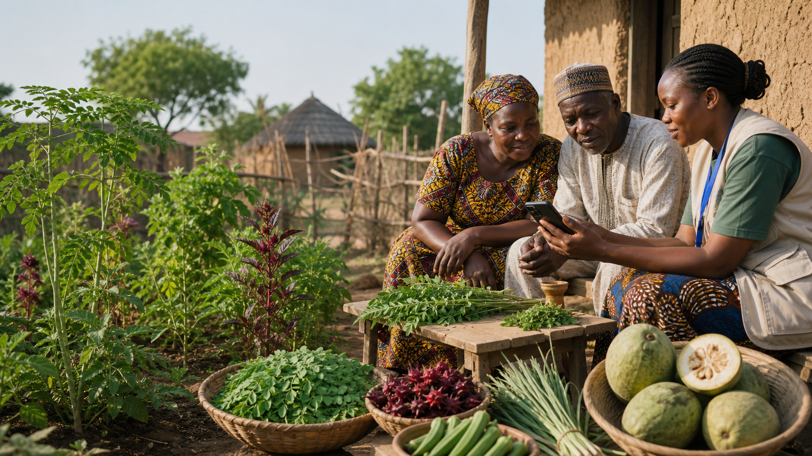
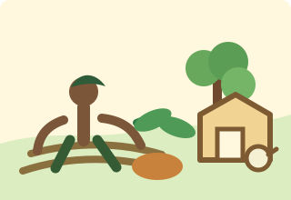
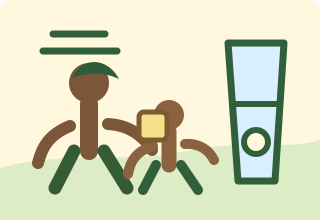
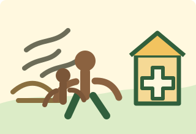
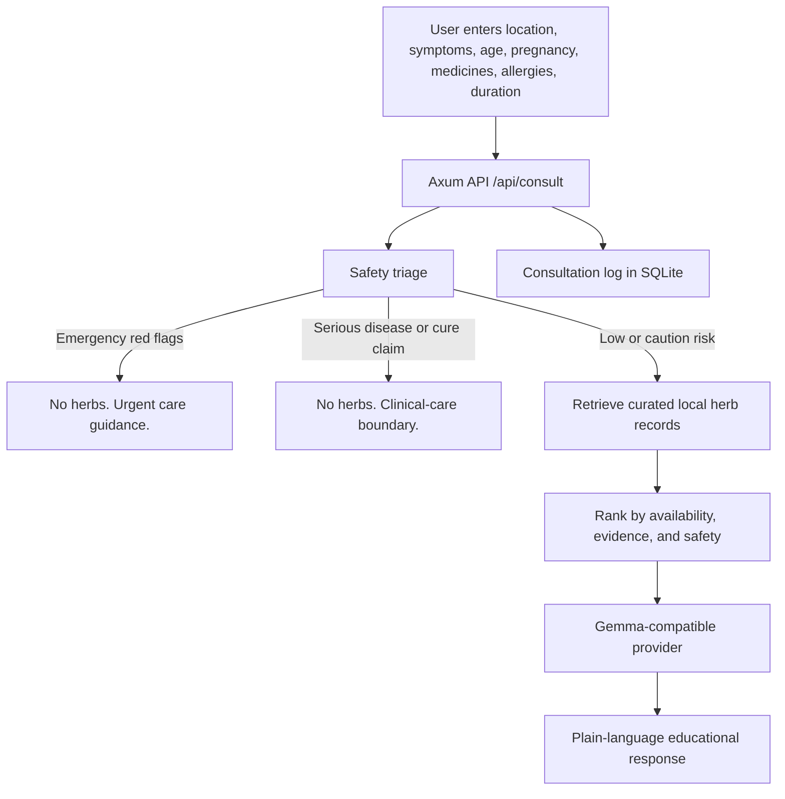
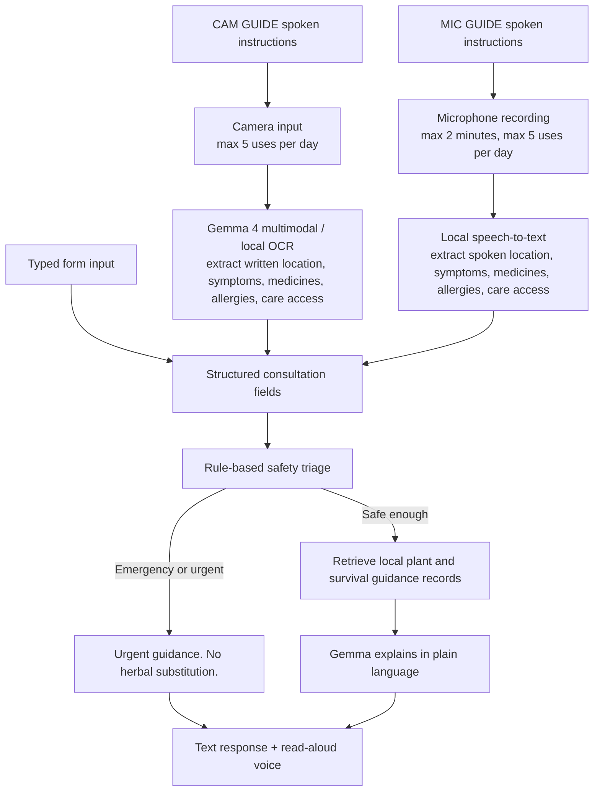
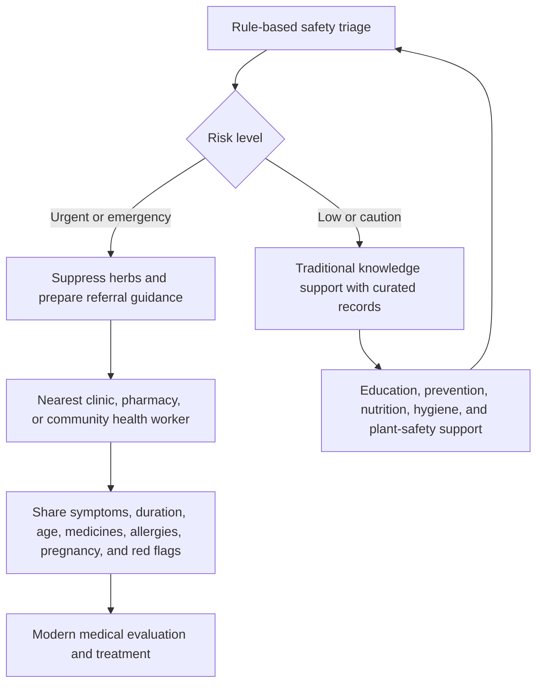
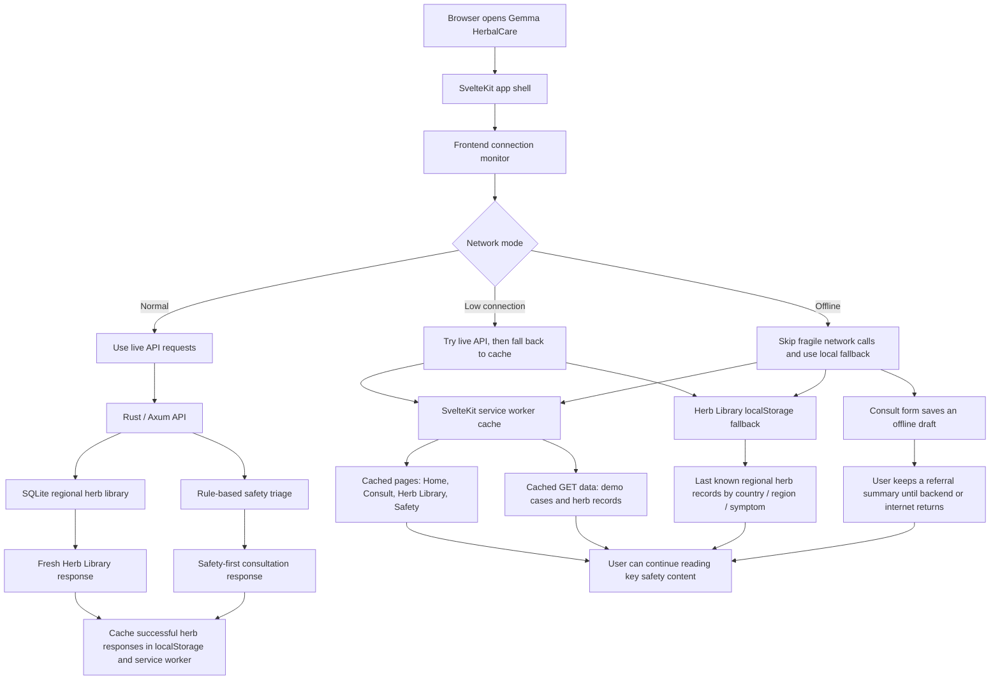
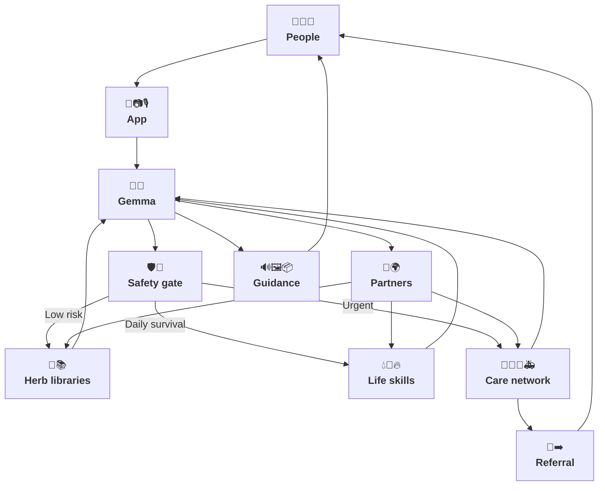

# Gemma HerbalCare

**Gemma HerbalCare is a safety-first, local-first herbal knowledge assistant that helps communities explore traditional remedies without delaying urgent medical care.**

Gemma HerbalCare is built for the Kaggle Gemma 4 Good Hackathon as a practical AI-for-good prototype: not an AI doctor, not a diagnosis system, and not a generic symptom chatbot.

**Live public demo:** https://herbalcare.voidforge.pro/

It is an educational support tool for communities that still depend on local medicinal knowledge, where internet access may be unreliable, clinics may be far away, and traditional plant knowledge is disappearing faster than it is being documented.

The product principle is simple:

**Before suggesting any herb, check whether suggesting herbs would be unsafe.**

If a user describes danger signs such as breathing difficulty, chest pain, pregnancy bleeding, severe fever, suspected malaria, cancer cure requests, or other serious conditions, Gemma HerbalCare suppresses herbal suggestions and gives urgent-care guidance instead. If the situation is lower risk, it retrieves curated local herb records and asks Gemma to explain them in plain, cautious language.

This project treats traditional knowledge with respect while adding the guardrails needed for responsible AI deployment.



## Demo Highlights

- **Public web app:** https://herbalcare.voidforge.pro/
- **Child diarrhea:** prioritizes ORS, hydration, and danger signs before mentioning any herb.
- **Suspected malaria:** recommends urgent testing and appropriate antimalarial care; suppresses herbal substitution.
- **Possible worms in a child:** keeps the response caution-level and points users toward qualified diagnosis and deworming medicine.
- **Cloudy well water:** explains settling, cloth filtering, boiling, and chemical-contamination limits.
- **Long-term food source plan:** suggests realistic local food resilience options such as sweet potato, moringa, and chickens.
- **Poor breathing after indoor smoke:** detects an emergency red flag and returns urgent-care guidance only.
- **Real plant photos:** the herb library now uses public real-world plant images with source links so users can recognize plants more safely than from generic illustrations.
- **Mobile and offline direction:** the home page introduces an iOS/Android app concept for carrying regional herb records, food plants, water-safety steps, and red-flag guidance into areas with weak or no internet.
- **Connection modes:** the header detects Normal, Low Connection, and Offline modes, then explains when cached pages, saved drafts, or local records may be used.
- **PWA/offline cache:** the frontend includes a service worker that caches the app shell, static assets, demo cases, and herb-library GET responses for better behavior on poor connections.
- **Multilingual header and home page:** the app includes a lightweight language switcher for English, Swahili, Hindi, Chinese, Korean, Spanish (Peru), and Dari (Afghanistan) as a first step toward broader community access.
- **Location-aware referral guidance:** Phase 1 urgent and emergency responses suggest the nearest clinic, hospital, pharmacy, community health worker, NGO field worker, or trusted transport helper near the user's city/region/country, without inventing unverified facility names.

## Visual Guidance for Real Communities

Gemma HerbalCare is designed for people, not papers. The goal is not only to answer questions correctly, but to help communities understand, remember, and act on safe guidance in daily life.

Many users who could benefit from this tool may have limited literacy, limited internet access, limited trust in formal medical language, or little time to read long explanations. For them, a useful AI system must feel closer to a community field guide than an academic report.

That is why the prototype adds a **visual guidance layer** to Gemma responses. When Gemma explains practical steps, the interface can show simple, friendly illustrations for ideas such as:

- preparing ORS and giving small sips
- making cloudy water safer
- starting a small food plot with sweet potato or moringa
- keeping chickens only when water, shade, feed, and protection are realistic
- moving away from indoor smoke and seeking urgent help for breathing trouble
- confirming a plant before preparing it

The philosophy is simple: **solutions for humanity should be understandable at community scale, not only impressive to experts.** A responsible developer should keep asking how to make advice clearer, warmer, safer, and closer to the people who need it.

| Food resilience | ORS and hydration | Safe water | Breathing danger | Plant confirmation |
|---|---|---|---|---|
|  |  |  |  |  |

These illustrations are intentionally simple SVGs for general actions and safety concepts. They are lightweight, offline-friendly, culturally adaptable, and safer than asking a generative image model to invent visuals during a consultation.

For plant identification, the app now takes a stricter approach: **the Herb Library uses real public plant photos with source links**, not generic local SVG icons. A person trying to find ginger, guava leaf, neem, tulsi, mint, curry leaf, aloe, or other plants in the real world needs visual references that resemble actual leaves, roots, seeds, and bulbs. Generic art is useful for explaining actions; real photos are more useful for field recognition.

## Offline Herb Library and Mobile Direction

The latest UI adds a mobile/offline direction because many of the people this project is meant to help may live far from clinics, mobile data may be expensive, and internet access may disappear during floods, conflict, power cuts, or travel between villages.

The proposed iOS/Android companion app would act as a local **regional knowledge cache**, not just a website shortcut. It could store:

- curated herb records by country, region, and local name
- real plant photos and identification notes
- safety notes, contraindications, and interaction warnings
- ORS and clean-water guidance
- long-term food resilience ideas such as sweet potato, moringa, okra, and chickens
- red-flag guidance for cases where herbs should be hidden and urgent care should be sought

This matters because an offline app can still help a community worker, elder, parent, or traveler when the network is unavailable. The safest knowledge should be available before the model, the cloud, or the internet becomes reachable.

The mobile direction is also designed to support downloadable regional packs. A Bihar pack, a Kano pack, or a Southeast Asia pack could include only locally relevant plants and warnings, making the app smaller, faster, and easier to maintain with local partners.

## Multilingual Direction

The current prototype adds a lightweight language switcher for the header and full home page copy in:

- English
- Swahili
- Hindi
- Chinese
- Korean
- Spanish (Peru)
- Dari (Afghanistan)

This is intentionally a first step, not a claim that the whole medical flow has been professionally translated. The goal is to show that the product is designed for many communities, not only English-speaking users. Future work should expand this into full-screen translation for forms, triage messages, herb records, read-aloud responses, and offline mobile packs.

Multilingual support is especially important for remote communities because low-literacy and low-connectivity users often also need local-language explanations. A safety-first app is more useful when it can say “go to a clinic now,” “mix ORS this way,” or “this herb is supportive only” in words the user actually understands.

## Accessibility and Multimodal Direction

The hackathon theme is not just local AI. It is local AI that can help real people. In the communities this app is designed for, some users may not be able to type, read a long answer, see a small phone screen clearly, or describe a plant or medicine label in writing.

The current prototype therefore adds an accessibility layer:

- **Read-aloud response:** the consultation result includes a speaker control that uses browser text-to-speech so a low-literacy user, older adult, or visually impaired user can hear the guidance.
- **Camera intake placeholder:** the consultation form accepts an image upload and preview. In this prototype, the image is not sent to the backend; it documents the intended flow for local OCR and visual triage support.
- **Voice-input placeholder:** the form includes a microphone control explaining the phase-2 plan for local speech-to-text, so users who cannot type can speak symptoms or questions.
- **CAM GUIDE and MIC GUIDE:** the consultation form includes spoken usage guides for the phase-2 camera and microphone flows. These guides are intentionally slow and simple so a low-literacy or visually impaired user can hear what the buttons are for before using them.

The product boundary is important: image input is planned as **visual triage support**, not visual diagnosis. The app should help read labels, inspect water clarity, compare a plant against a curated record, or notice danger signs that need urgent care. It should not claim to diagnose malaria, pneumonia, cancer, skin disease, or any other condition from a photo.

Phase-2 usage rules are explicit in the prototype:

- **CAM is not diagnosis.** It is planned for OCR and visual support. A user who cannot type could write location, symptoms, age group, duration, pregnancy status, medicines, allergies, and care access on paper, then take a clear photo.
- **MIC is not voice chat.** It is planned for short recording and local speech-to-text. A user who cannot type could speak the same consultation details clearly.
- **Public prototype limits:** CAM and MIC are planned to be limited to 5 uses per day per device in the public prototype to reduce spam, accidental repeated submissions, and overloaded local/server compute.
- **Verified field limits:** verified clinics, NGOs, or community health workers could receive higher limits because one trusted device may support many people.
- **Emergency access:** urgent-care guidance, safety pages, typed consultation, cached herb records, ORS guidance, safe-water guidance, and referral guidance should remain available even if a CAM/MIC limit is reached.
- **Recording limit:** microphone recordings should be capped at 2 minutes so the app receives concise field information rather than long open-ended conversations.
- **Privacy boundary:** camera and microphone data should be processed locally where possible. If upload is required, the user should be told clearly, the data should not be used for model training without consent, and retention should be minimized.
- **Return to the same safety flow:** camera OCR and microphone speech-to-text should produce structured text fields, then return to the normal consultation path: rule-based safety triage first, retrieval second, Gemma explanation last.

Planned local multimodal stack:

- **Gemma 4 multimodal:** local image/OCR, speech-derived context, and visual-context understanding where runtime support is available. Gemma 4 should process CAM/MIC outputs only after they are converted into structured consultation context.
- **Local speech-to-text:** offline speech intake for low-literacy users and community health workers.
- **Local text-to-speech:** spoken answers in local languages where suitable voices are available.
- **Safety filter before vision output:** photos can add context, but triage and refusal rules still decide whether herbal advice is safe.

This roadmap fits the core thesis: **AI should still help when the user cannot type, cannot read, has weak connectivity, or cannot reach care immediately.**

## What This Is, and Is Not

Gemma HerbalCare is **not**:

- a doctor replacement
- a medical diagnosis system
- a prescription tool
- a generic symptom checker
- a chatbot that freely invents herbal advice

Gemma HerbalCare **is**:

- a safety-first herbal knowledge assistant
- an educational support tool
- a traditional knowledge preservation platform
- a local-first AI accessibility project
- a retrieval-grounded system for explaining curated regional plant records
- a visual field guide for practical health, hygiene, food resilience, and plant-safety education

## Why This Matters

In many communities, herbal medicine is not an alternative lifestyle choice. It is often the first available response when professional care is delayed by distance, cost, conflict, floods, poor roads, or unreliable connectivity.

At the same time, unguarded AI can be dangerous in exactly this setting. A fluent model can invent herbs, doses, cures, or false reassurance while sounding confident. That can delay treatment for malaria, sepsis, pregnancy complications, severe dehydration, heart attack, cancer, or dangerous medicine interactions.

Gemma HerbalCare exists because two things can be true at once:

1. Local medicinal knowledge is culturally important and practically useful.
2. Serious illness still needs professional care, escalation, and safety boundaries.

The system is designed to preserve and explain local knowledge without turning that knowledge into unsupported medical certainty.

It also recognizes that improving community health is not only about herbs. Safe water, sanitation, hydration, nutrition, smoke exposure, and realistic household resilience matter too. Gemma HerbalCare therefore treats herbal knowledge as one part of a broader education layer for safer daily living.

## Canonical Field User Scenarios

### Rural Health Volunteer With Unreliable Internet

A community health volunteer in northern Vietnam has intermittent connectivity and a basic smartphone. They need to explain common local plants in simple language, but also need help recognizing when the correct response is referral, not home care.

Gemma HerbalCare can run with a local dataset and a small/local Gemma-compatible model so the volunteer can access structured guidance even when the network is weak.

### Flood-Isolated Village Before Outside Support Arrives

A village is temporarily isolated after flooding. People ask about diarrhea, unsafe water, mild cough, and locally available plants. Gemma HerbalCare prioritizes safe water, ORS, danger signs, and escalation while explaining only support-level local knowledge.

The app does not pretend to replace medical response. It helps reduce harm during the gap before care arrives.

### Elderly Villager With Traditional Knowledge

An elder knows local herbs by experience but cannot read medical terminology or internet health pages. Gemma HerbalCare can preserve plant records with local names, safety notes, preparation context, and plain-language explanations that are easier to share across generations.

### Community Worker Explaining Safe Boundaries

A community worker is asked whether herbs can treat suspected malaria or replace prescribed medicine. Gemma HerbalCare refuses unsafe substitution, explains why testing and proven medicine matter, and keeps herbal knowledge in an educational support role.

## Why Gemma Matters

Gemma is used as a careful explainer and contextualizer, **not as the source of medical truth**.

The backend gives Gemma:

- the user's location and symptom context
- the deterministic triage result
- retrieved herb records, if the case is safe enough for herbs

Curated records control the knowledge. Safety rules constrain the workflow. Gemma turns structured information into guidance a low-literacy user can understand.

This is especially important for multilingual and local-first AI. A large model can organize and contextualize knowledge. Smaller local models can make that knowledge accessible offline to communities that need it.

Gemma HerbalCare is therefore designed for:

- multilingual explanation
- low-literacy communication
- visual-first learning support
- accessibility-first interaction with image preview, read-aloud responses, and planned local speech input
- local/offline deployment
- culturally aware plant knowledge
- responsible refusal behavior

## What Makes It Different From a Chatbot

Gemma HerbalCare does not start by generating an answer. It starts by deciding whether generation would be safe.

Workflow:

1. Detect danger first.
2. Refuse unsafe herbal advice.
3. Retrieve curated local herbal records.
4. Ask Gemma to explain, not invent.
5. Log consultation traces for future review and evaluation.

This reduces hallucination risk because the model is not asked to freely produce medicinal claims. It receives bounded records with evidence level, source URL, safety notes, contraindications, interactions, and preparation context.

The goal is educational guidance, not speculative diagnosis.

## Architecture



The key rule: **Gemma never decides whether an emergency should receive herbal suggestions.** The application decides that first.

Planned multimodal extension:



This phase-2 flow keeps camera and microphone input as accessibility doors into the same safety-first path. CAM should not diagnose from photos, and MIC should not behave like open-ended voice chat. Both flows should help users submit the same consultation facts they would otherwise type, then return to the rule-based triage, retrieval, and Gemma explanation pipeline.

Planned clinical referral extension:



**The app can preserve and explain traditional plant knowledge for low-risk support, while actively routing serious cases toward modern medical care.**

This is the long-term bridge. Gemma HerbalCare is not intended to replace Google Search, public health channels, clinic hotlines, emergency services, or existing medical apps. It is a safety-first layer that helps people understand local traditional knowledge when appropriate, while making the path to modern medical care clearer when symptoms are serious. The project should not frame traditional medicine and modern medicine as competitors.

In Phase 2, this could include optional integration with local clinics, pharmacies, community health workers, NGO field teams, emergency contacts, or referral directories so urgent cases receive a concrete next step rather than a generic warning.

For example, if the app detects suspected malaria, severe dehydration, pregnancy bleeding, breathing difficulty, or stroke-like symptoms, it could generate a short referral summary that a caregiver can show to a health worker: location, age group, duration, symptoms, medicines, allergies, pregnancy status, care access, and red flags. This would make the app a practical bridge between household-level knowledge and local health systems.

Low-connection engineering approach:



The engineering goal is graceful degradation across three modes:

- **Normal:** the app behaves like a regular live web app and refreshes API data normally.
- **Low Connection:** the app still tries live requests, but explains that cached pages and local records may be used if the network is slow or unreliable.
- **Offline:** the app avoids fragile network calls where possible. The Herb Library reads cached regional records from the device. The Consult page remains interactive, saves the current consultation draft locally, and gives a danger-sign/referral summary that the user can show to a health worker until the local backend or internet returns.

The browser-side signal uses `navigator.onLine`, supported Network Information API hints such as data saver or slow connection type, and a lightweight `/health` ping with a timeout. The Herb Library caches successful regional searches on the device and falls back to those records when future requests fail or when the browser is offline. The SvelteKit service worker caches the app shell, static assets, demo cases, and herb-library GET responses so the most important educational surfaces remain available after the first successful load.

Rust and SvelteKit split the problem cleanly. SvelteKit handles browser-side resilience: connection detection, localStorage fallback, and service-worker caching. Rust handles server-side resilience: one compact Axum service, deterministic safety triage, and a local SQLite knowledge base that can run close to the user without a cloud database dependency. Together, this supports the core design goal: the app should still provide safety education and previously cached regional knowledge when internet access is weak.

### Technical Stack

- **Backend:** Rust, Axum, Tokio, Serde, SQLx, SQLite, reqwest
- **Frontend:** SvelteKit, TypeScript, CSS
- **Retrieval:** local SQLite herb library with regional availability records
- **LLM integration:** mock provider by default, HTTP Gemma-compatible provider for local or hosted inference
- **Deployment shape:** local-first architecture that can be packaged for clinics, NGOs, community health workers, and offline demos
- **Connectivity support:** frontend connection monitor, Herb Library cache fallback, and SvelteKit service worker for app-shell/API GET caching
- **Language UI:** lightweight header and home-page language switcher for English, Swahili, Hindi, Chinese, Korean, Spanish (Peru), and Dari (Afghanistan)
- **Visual records:** real public plant photos for herb identification, plus lightweight local illustrations for practical safety guidance

### Why Rust and SvelteKit for Poor Connectivity

The stack is intentionally chosen for weak-network and edge-AI conditions. In remote areas, the app should not depend on a heavy cloud backend, a large JavaScript bundle, or always-on internet just to show safety guidance.

Rust gives the backend a small, fast, reliable service layer that can run as a single binary or compact container. With Axum and SQLite, one local machine can serve the API, store regional herb data, run deterministic safety triage, log consultations, and connect to a local Gemma/Ollama endpoint when available. This is useful for rural clinics, NGO laptops, school computers, community-worker devices, or low-cost edge servers.

SvelteKit keeps the frontend lightweight and cache-friendly. The built UI can be served by the same Rust backend, reducing deployment complexity to one service. It also creates a practical path toward PWA-style caching and mobile/offline regional packs, so the interface can remain usable when internet access is slow, intermittent, or unavailable.

This is also a modern AI-supportive stack. Rust is increasingly strong for edge services, local inference orchestration, WebAssembly-adjacent tooling, and safe high-performance systems. SvelteKit gives a fast frontend surface for AI workflows such as streaming responses, camera/voice UX, read-aloud controls, and multilingual interfaces without making the app heavy. Together, they support the core thesis: **local AI should still be useful when the cloud is far away.**

### Core Modules

```text
backend/
  src/
    safety.rs      # red flags, serious-condition boundaries, triage
    routes.rs      # API handlers
    db.rs          # SQLite schema, seed data, retrieval, logging
    llm.rs         # Gemma provider trait, mock provider, HTTP provider, prompt
    models.rs      # request/response/database structs
frontend/
  src/routes/      # SvelteKit UI pages
docs/
  architecture.md
  safety_policy.md
  demo_script.md
```

### TODO Placeholders

- [ ] Add high-resolution architecture diagram.
- [ ] Add screenshots of consultation, herb library, safety page, and refusal states.
- [ ] Add embedded demo video link.
- [ ] Add offline deployment demo with a local Gemma-compatible endpoint.
- [ ] Expand the language switcher from header/navigation into full app translations and local-language read-aloud flows.
- [ ] Package offline regional herb libraries for mobile devices and low-connectivity field use.

## Safety-First Design

Gemma HerbalCare is intentionally conservative. The system never claims herbs cure serious disease and never advises users to stop prescribed medicine.

### Core Difference: Rule-Based Safety Triage Before Gemma

The most important design decision in Gemma HerbalCare is that **the safety gate is rule-based, not model-based**.

Gemma is powerful at explaining structured knowledge, but it should not be the only component deciding whether a sick person should receive herbal suggestions. In a low-resource setting, a fluent model response can sound confident even when it misses a danger sign. For this reason, Gemma HerbalCare uses deterministic application rules before retrieval and before generation:

1. The backend checks the user's symptoms, age group, pregnancy status, duration, known conditions, medicines, allergies, and care access.
2. If emergency or urgent conditions are detected, herb retrieval is suppressed.
3. If herbs are suppressed, Gemma receives no local herb records to turn into advice.
4. For urgent and emergency cases, the response includes a location-aware care access suggestion and a short referral summary the user can show to a health worker.
5. If the case is lower risk, Gemma can only explain curated records with safety notes, evidence levels, contraindications, interactions, and source links.

This makes the app different from a generic chatbot. **Gemma explains; the application decides when it is safe to explain herbs.**

The Phase 1 rule set has been updated to cover the main safety categories needed for the demo and hackathon scope:

- emergency breathing and chest symptoms
- severe allergic reaction
- confusion, unconsciousness, seizure, stroke-like symptoms
- severe dehydration and inability to drink
- blood in stool or vomit
- prolonged fever or very high fever
- pregnancy bleeding or severe pain
- infant fever and child severe-illness signs
- suspected malaria and severe malaria boundaries
- serious disease or cure claims, including cancer, HIV/AIDS, tuberculosis, sepsis, organ failure, uncontrolled diabetes, and heart attack
- medicine-replacement boundaries for antibiotics, insulin, antiretroviral therapy, chemotherapy, anticoagulants, and emergency care

The rules are intentionally conservative. For this prototype, a false positive is safer than a false negative: it is better to hide herbs and tell the user to seek care than to accidentally encourage home treatment for a dangerous condition.

Phase 1 does not claim to know the exact nearest hospital or clinic. It has no verified facility directory yet. Instead, it uses the user's location fields to recommend the nearest available clinic, hospital, pharmacy, community health worker, NGO field worker, emergency contact, referral directory, or trusted transport helper in or near that area. This keeps the guidance useful without fabricating facility names. Phase 2 can replace this with verified local facility integrations where partnerships exist.

The red-flag categories were informed by public-health and clinical safety references, including WHO childhood danger-sign guidance, CDC severe food poisoning/dehydration warning signs, CDC malaria and severe malaria guidance, and CDC urgent maternal warning signs. These references are not copied as a clinical protocol; they are used to shape a transparent Phase 1 safety filter appropriate for an educational AI prototype.

Known limitation: keyword rules can miss local phrases, spelling mistakes, negation, slang, and languages not yet covered. The next safety step is not to replace the rules with Gemma, but to expand the rules with multilingual synonyms, clinician-reviewed test cases, and a safety evaluation suite that measures emergency recall and herb-suppression accuracy.

Safety behaviors include:

- **Emergency suppression:** if red flags are detected, herbs are not retrieved or shown.
- **Refusal behavior:** cure claims and serious disease requests receive clinical-care boundaries.
- **Escalation logic:** the response prioritizes emergency care, clinics, pharmacies, community health workers, or trusted local help.
- **Location-aware referral:** urgent and emergency answers use the user's city, region, and country to suggest nearby care options without inventing exact facility names.
- **Hallucination minimization:** Gemma receives only retrieved records and explicit safety instructions.
- **Evidence transparency:** each herb record includes evidence level and source context.
- **Medicine caution:** the app warns against replacing antibiotics, insulin, antiretroviral therapy, chemotherapy, anticoagulants, or emergency care.
- **Educational-only framing:** every response is positioned as support information, not diagnosis, prescription, or medical advice.

Gemma HerbalCare suppresses herbal recommendations for emergency or serious conditions, including:

- chest pain
- difficulty breathing
- severe allergic reaction
- pregnancy bleeding or severe pain
- fever above 39.5C
- fever lasting more than 3 days
- suspected malaria
- suspected cancer or cancer cure requests
- HIV/AIDS without clinical care
- tuberculosis
- stroke symptoms
- heart attack symptoms
- sepsis or severe infection
- kidney failure
- liver failure
- uncontrolled diabetes

Safety references used to shape the Phase 1 rule set:

- WHO IMCI Handbook: general danger signs for sick children, including inability to drink or breastfeed, lethargy/unconsciousness, convulsions, and severe illness patterns.  
  https://iris.who.int/bitstream/handle/10665/42939/9241546441.pdf
- CDC Food Safety: severe food poisoning warning signs, including bloody diarrhea, diarrhea lasting more than 3 days, high fever, frequent vomiting, and dehydration.  
  https://www.cdc.gov/food-safety/signs-symptoms/
- CDC Malaria: severe malaria can involve seizures, mental confusion, coma, kidney failure, respiratory distress, and organ dysfunction, and should be treated urgently.  
  https://www.cdc.gov/malaria/symptoms/
- CDC Severe Malaria clinical guidance: severe malaria manifestations require prompt aggressive treatment.  
  https://www.cdc.gov/malaria/hcp/clinical-guidance/treatment-of-severe-malaria.html
- CDC Hear Her: urgent maternal warning signs including severe headache with vision changes, severe belly pain, chest pain, and vaginal bleeding or fluid leaking during pregnancy.  
  https://www.cdc.gov/hearher/maternal-warning-signs/

## Case Studies From the Demo

### Child Diarrhea After Unsafe Water

The app treats diarrhea as a hydration and safety problem first. It emphasizes ORS before herbs, gives the simple fallback recipe for safe water, sugar, and salt when no ORS packet is available, and then explains support-only local plant records with warnings.

### Fever and Suspected Malaria

The app treats suspected malaria as urgent. It can mention that quinine historically came from Cinchona bark, but it does not suggest raw bark, self-dosing, or herbal replacement. It pushes testing and appropriate antimalarial medicine from a clinic, pharmacy, or community health worker.

### Possible Worms in a Child

The app marks the case as caution-level because the user is a child. It keeps the answer focused on professional diagnosis, appropriate deworming medicine from a qualified source, hygiene, and danger signs instead of pretending herbs can confirm or cure parasitic infection.

### Making Cloudy Well Water Safer

The app handles water safety as a practical household question. It explains settling cloudy water, filtering through clean cloth, boiling at a rolling boil for 1 minute, and cooling covered, while warning that boiling and filtering do not remove chemical contamination such as fuel, pesticides, or heavy metals.

### Long-Term Food Source Plan

The app can shift from symptom support to resilience planning. In the demo, it suggests starting small with realistic local food plants such as sweet potato and moringa, and only considering chickens when water, shade, feed, and protection are available.

### Poor Breathing After Indoor Cooking Smoke

The app detects difficulty breathing as an emergency red flag. It suppresses all herb suggestions and returns urgent-care guidance only.

## API

- `GET /health`
- `GET /api/herbs?country=&region=&symptom=`
- `POST /api/triage`
- `POST /api/consult`
- `GET /api/consultations/:id`
- `GET /api/demo-cases`

Example consultation:

```json
{
  "country": "India",
  "region": "Bihar",
  "city": "Gaya",
  "symptoms": "mild cough, sore throat, runny nose, temperature 37.8C",
  "age_group": "adult",
  "pregnant": false,
  "known_conditions": [],
  "current_medicines": [],
  "allergies": [],
  "duration_days": 1,
  "care_accessible": false
}
```

## Run Locally

Start the backend:

```bash
cd backend
cargo run
```

Start the frontend:

```bash
cd frontend
npm install
npm run dev
```

Open:

```text
http://localhost:5173
```

The frontend expects the API at:

```text
http://localhost:8080
```

## Deploy to Google Cloud

The public deployment is live at:

```text
https://herbalcare.voidforge.pro/
```

The project includes a root `Dockerfile` for a single Cloud Run service. The Rust/Axum backend serves both the API and the built SvelteKit frontend, so the whole app can run behind one custom subdomain.

Deployment notes are in [docs/deploy_google_cloud.md](docs/deploy_google_cloud.md).

## Use a Gemma Endpoint

The app runs with a mock provider by default so judges can test the full flow without model setup.

To use an HTTP Gemma-compatible endpoint:

```bash
cd backend
GEMMA_PROVIDER=http GEMMA_MODEL=gemma4 cargo run
```

The default HTTP URL is compatible with Ollama's local generate API:

```text
http://localhost:11434/api/generate
```

Override it if your Gemma endpoint runs elsewhere:

```bash
GEMMA_PROVIDER=http GEMMA_API_URL=http://localhost:11434/api/generate GEMMA_MODEL=gemma4 cargo run
```

The provider posts:

```json
{
  "model": "gemma4",
  "prompt": "...",
  "stream": false
}
```

It accepts `text`, `response`, or `choices[0].text` in the JSON response.

## Why This Fits the Hackathon

Gemma HerbalCare has a clear AI-for-good thesis and a working safety architecture:

- **Responsible AI:** generation is bounded by triage, retrieval, refusal rules, and educational-only framing.
- **Real-world problem:** the app targets the dangerous gap between symptoms appearing and professional care becoming reachable.
- **Local-first design:** plant knowledge is regional, source-linked, and structured for offline-friendly use.
- **Offline access path:** the mobile direction treats herb records, safety rules, ORS, water, and food-resilience guidance as knowledge that should remain available even without internet.
- **Poor-connectivity tech stack:** Rust, SQLite, and SvelteKit keep the system lightweight enough for edge devices, local servers, one-service deployment, and future PWA/mobile offline caching.
- **AI-ready edge architecture:** the backend can use mock, local Gemma/Ollama, or hosted Gemma-compatible endpoints while keeping safety triage and retrieval local and deterministic.
- **Inclusive language path:** the current language switcher demonstrates the product direction toward Swahili, Hindi, Chinese, Korean, Spanish for Peru/South America, Dari for Afghanistan, and other local-language packs.
- **Cultural preservation:** the system can document local names, preparation context, safety notes, and regional availability before knowledge is lost.
- **Clear model role:** Gemma translates controlled knowledge into accessible guidance instead of acting as an unconstrained medical authority.
- **Scalable path:** the architecture can support multilingual voice flows, clinician-reviewed datasets, safety evaluations, and community health worker deployments.

## Phase 2: Competitive Extensions

- **Multilingual support:** expand the current English, Swahili, Hindi, Chinese, Korean, Spanish (Peru), and Dari (Afghanistan) home-page switcher into full app translation and read-aloud flows, then add other local and low-resource languages.
- **Voice-first interaction:** local speech input and spoken responses for low-literacy users.
- **Plant/photo intake:** image-based OCR and visual triage support for plant records, water clarity, labels, and visible danger signs, with strong uncertainty warnings and expert confirmation requirements.
- **Offline bundle:** deployable package for rural clinics, NGOs, schools, community health workers, and mobile users without reliable internet.
- **Local healthcare integration:** connect urgent or emergency cases to nearby clinics, pharmacies, community health workers, NGO field teams, emergency contacts, or referral directories where partnerships exist.
- **Safety evaluation suite:** refusal tests, grounding tests, hallucination tests, and emergency escalation tests.
- **Regional herbal datasets:** Southeast Asia, Korea, Africa, Latin America, and other community-reviewed sources.
- **Lightweight edge deployment:** small-model local inference for low-connectivity environments.
- **Research review tools:** consultation trace review, source provenance, dataset quality checks, and clinical/public-health partner workflows.

## Long-Term Vision

Gemma HerbalCare could grow into a global, multilingual herbal knowledge map: part ethnobotanical dictionary, part cultural preservation platform, part local-first AI accessibility tool.

Long term, the platform could help communities and researchers document medicinal plant knowledge across:

- Southeast Asia
- Korea
- Traditional Chinese Medicine
- Ayurveda
- African traditional medicine
- Amazon and other Indigenous traditions

This future version would remain educational and research-oriented. It would not convert traditional knowledge into unsupported medical certainty.

Possible research directions include:

- biodiversity preservation
- endangered knowledge preservation
- sustainable cultivation research
- regional plant availability mapping
- local-language plant dictionaries
- safer community health education

With appropriate partners, the platform could help researchers and communities understand which regions commonly face certain health concerns, which medicinal plants are locally available, and which plants may be suitable for sustainable cultivation in those environments.

The goal is not to replace clinicians. The goal is to preserve knowledge, improve access, reduce harm, and make responsible AI useful where connectivity and care access are limited.

## Future Work

### Future Platform Flow

The long-term idea is for Gemma HerbalCare to become a safety-first platform for people anywhere in the world to understand local herbs, survival guidance, and care access without treating traditional knowledge as a replacement for modern medicine.

Gemma would sit at the center as an **orchestrator**: it translates user needs, routes requests to the right knowledge source, explains retrieved information in simple local language, and escalates serious cases toward verified care pathways.



Icon guide:

- 👤👵👧 **People:** global users, caregivers, elders, children, and community workers.
- 📱📷🎙️ **App:** mobile/web interface with text, camera, voice input, and read-aloud output.
- 🧠✨ **Gemma:** the central navigator that translates, explains, routes, and escalates.
- 🛡️🚨 **Safety gate:** deterministic triage for red flags, pregnancy risk, child risk, severe symptoms, and unsafe cure claims.
- 🌿📚 **Herb libraries:** digital local herb records with photos, local names, evidence, contraindications, interactions, and source links.
- 💧🌾🔥 **Life skills:** safe water, ORS, sanitation, food resilience, smoke reduction, and practical rural survival guidance.
- 🏥🧑‍⚕️🚑 **Care network:** clinics, pharmacies, community health workers, referral directories, emergency contacts, and trusted transport helpers.
- 🤝🌍 **Partners:** NGOs, public-health teams, local experts, and community reviewers who publish trusted regional packs.
- 🔊🖼️📦 **Guidance:** simple local-language answers, visual steps, spoken output, and offline-ready summaries.
- 📄➡️ **Referral:** a short summary of location, symptoms, duration, age, medicines, allergies, pregnancy status, and red flags for a health worker.

In this future version, the app would not be just a herb lookup tool. It would be a local-first coordination layer that can:

- route low-risk questions to curated regional herb records
- route water, food, sanitation, and smoke-exposure questions to practical rural guidance
- route urgent cases toward nearby clinics, pharmacies, community health workers, NGO field teams, or emergency contacts
- let trusted partners publish regional knowledge packs that can work offline
- keep Gemma in the role of translator, explainer, and navigator rather than unconstrained medical authority

- Add clinician-reviewed regional datasets for Vietnam, Southeast Asia, Africa, and Latin America.
- Add multilingual and voice-first flows for low-literacy users.
- Integrate taxonomic validation from sources such as GBIF, POWO, and WFO.
- Add structured medicine interaction checks.
- Add offline deployment bundles for rural clinics and community health workers.
- Add evaluation tests for safety refusal, retrieval grounding, hallucination, and low-literacy response quality.

## Disclaimer

Gemma HerbalCare is an educational hackathon prototype. It is not medical advice, not a diagnosis, not a prescription, and not a replacement for professional care. Real deployment would require clinical review, local regulatory review, public health partnerships, language validation, and community governance.
