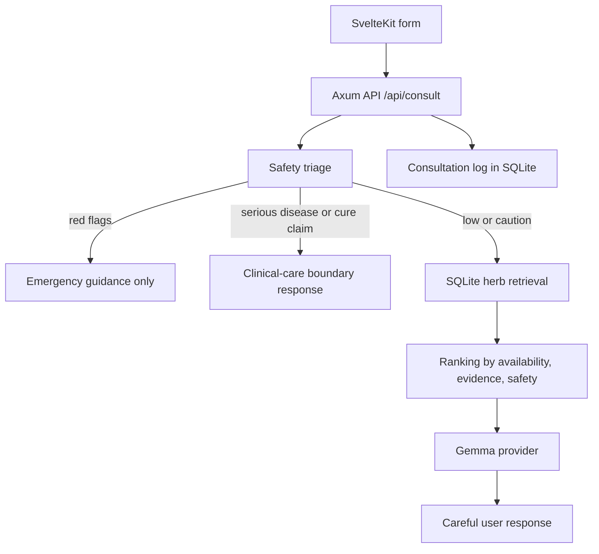

# Architecture

Gemma HerbalCare uses a small safety-first pipeline:

## Backend

The Rust backend exposes health, herb search, triage, consult, consultation lookup, and demo case endpoints. It creates the SQLite schema and seeds the curated dataset at startup so the demo runs with `cargo run`.

Core modules:

- `routes`: Axum handlers and API shape.
- `safety`: red-flag and serious-condition triage.
- `db`: schema creation, seed data, herb retrieval, consultation logging.
- `llm`: Gemma provider trait, mock provider, HTTP provider.
- `models`: request, response, and database structs.

## LLM Boundary

The Gemma provider receives only:

- User context
- Triage result
- Retrieved herb records

The prompt instructs the model not to invent herbs, cures, dosages, or medical claims. Emergency and urgent branches suppress herb retrieval before the provider call.

## Frontend

The SvelteKit UI contains:

- Home page with hackathon positioning.
- Consultation form with demo case buttons.
- Herb library with country, region, and symptom filters.
- Safety page explaining red flags, serious-disease boundaries, evidence levels, and future source integrations.

